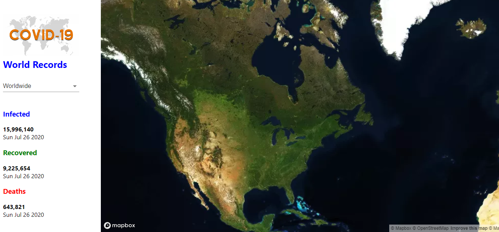

# COVID MAP

> COVIDMAP is aimed at displaying the current status of the covid-19 pandemic infected, recovered and death statistics by country and globally.

## Built With

-React.js
-Hooks
-Axios
-Mapbox
-API
-CSS MODULES

## Live Demo

[Live Demo Link](admiring-beaver-9b2ce5.netlify.app)
Coming soon

## Getting Started

To get a local copy up and running follow these simple example steps.

### Prerequisites
-Download and install Node
### Setup
Clone the repository by going to the terminal and enter coommand:
$git clone git@github.com:ngodi/covid-status.git
$cd covid-status
### Install
Run npm install to install all the dependencies
$npm install
### Usage
Run $npm start
## Authors

👤 **Author1**

- Github: [@ngodi](https://github.com/ngodi)
- Twitter: [@albertngodi](https://twitter.com/albertngodi)
- Linkedin: [linkedin](https://linkedin.com/albertngodi)

## 🤝 Contributing

Contributions, issues and feature requests are welcome!

Feel free to check the [issues page](issues/).

## Show your support

Give a ⭐️ if you like this project!

## Acknowledgments

-Hat tip to the creator and maintainer of 'https://covid-19.mathdro.id/api' API

## 📝 License

This project is [MIT](lic.url) licensed.
